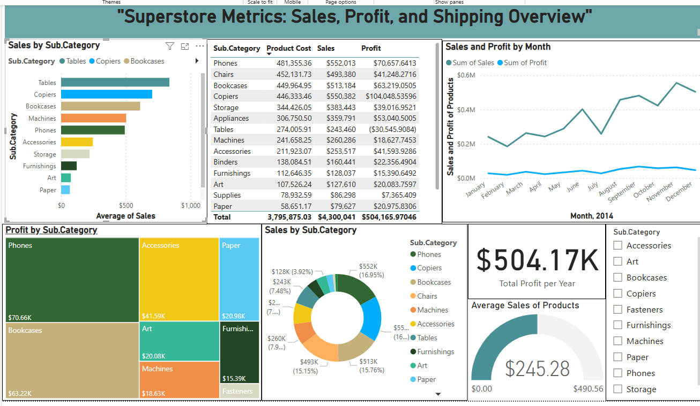
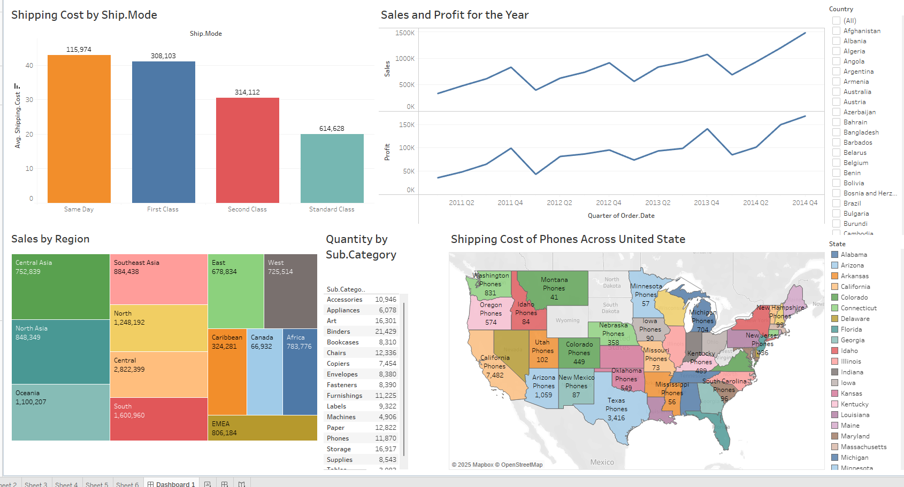

# Superstore-Portfolio-Project

## Superstore Sales, Profit, and Shipping Analysis Report
1. ### Introduction
- **Project Title**: Superstore Metrics: Sales, Profit, and Shipping Overview
- **Objective**: To analyze sales, profit, and shipping trends across different product categories and time periods to gain insights into business performance.
- **Tools Used**: Power BI, Tableau
- **Dataset**: Superstore dataset, containing transactional records of sales, profit, product categories, and shipment details.

2. ### Data Overview
- **Key Fields**:
- **Order Date, Ship Date**: Date fields to analyze trends.
- **Category, Sub-Category**: Product classifications.
- **Sales, Profit**: Key financial metrics.
- **Product Cost, Discount**: Factors influencing profitability.
- **Region, State**: Geographic sales analysis.
- **Customer Segment**: Business, Consumer, and Home Office segments.
- **Shipping Mode**: Standard, First Class, Second Class, and Same Day.

 ### Key Insights from the Power BI Superstore Metrics Visual Dashboard

 1. #### Sales Performance Analysis
- **Top-Selling Sub-Categories**:
-Phones ($552K), Chairs ($493K), and Copiers ($550K) generate the highest sales revenue.
- **Low-Selling Categories**:
  -Paper, Art, and Furnishings have relatively low sales volumes.

2.  #### Profitability Insights
  - **Most Profitable Sub-Categories**:
- Copiers ($104.4K), Phones ($70.6K), and Bookcases ($63.2K) yield the highest profits.
  -These categories not only contribute to revenue but also have healthy profit margins.
  - **Least Profitable Categories**:

- Machines ($18.6K) and Furnishings ($15.4K) generate lower profits.
- Supplies and Paper have minimal contributions to overall profit ($7.3K & $20.9K, respectively).

3. #### Sales and Profit Trend Analysis (Time-Series Analysis)
- **Monthly Performance**:
- Sales gradually increased from January to December, with noticeable peaks in July and October.
- Profit trends follow a similar pattern but remain significantly lower than sales values, indicating variable costs.
- December saw a slight decline in sales, possibly due to seasonality or discounting strategies affecting margins.

4. #### Category Contribution to Total Revenue
- Phones (16.95%), Chairs (15.15%), and Copiers (16%) make up nearly half of total sales.
- Categories like Art and Fasteners have the lowest contribution.

5. ### Business Implications and Recommendations
- **Focus on High-Profit Categories**: Invest more in marketing and inventory for Copiers, Phones, and Bookcases, as they drive both sales and profit.
- **Improve Performance in Low-Profit Categories**: Evaluate pricing and cost structures for Machines, Furnishings, and Paper to enhance profitability.
- **Optimize Sales Strategies for Seasonal Peaks**: Since sales peak in July and October, plan marketing campaigns and inventory accordingly.
- **Evaluate Shipping Impact on Profitability**: Further analysis on shipping costs could help improve profit margins.

   ### Key Insights from the Tableau Superstore Metrics Visual Dashboard
  

  1. #### Shipping Cost Analysis
- Standard Class (614,628) accounts for the highest shipping cost, indicating a preference for cost-effective shipping.
- Second Class (314,112) and First Class (308,103) have similar shipping costs, suggesting customers opt for faster shipping despite the higher expense.
- Same Day Shipping (115,974) is the least used but has a significantly higher average shipping cost per transaction.
2.#### Sales and Profit Trends Over Time
- Sales and profit have shown consistent growth from 2011 Q2 to 2014 Q4 with some fluctuations.
- There is a visible seasonal pattern, with peaks observed in multiple quarters, indicating strong demand cycles.
- The profit trend follows sales but at a lower magnitude, suggesting cost considerations impact overall margins.
3. #### Sales by Region
- **Top Performing Regions (Highest Sales)**:
- Central (2,822,399), North (1,248,192), and South (1,600,960) regions generate the highest sales.
- These regions should be prioritized for further investment and inventory stocking.
- **Underperforming Regions**:
- Canada (66,932) and the Caribbean (324,281) show significantly lower sales, requiring deeper investigation into demand trends.
- Southeast Asia and Oceania also exhibit strong sales contributions, suggesting expansion opportunities in those markets.
4. #### Quantity Sold by Sub-Category
- **Top Selling Sub-Categories (Highest Quantity Ordered)**:
- Binders (21,429), Paper (18,872), and Storage (16,917) indicate high demand.
- **Low Sales Volume Sub-Categories**:
- Machines (4,906) and Labels (3,092) have significantly lower order quantities, requiring analysis of pricing or market demand.
5. #### Shipping Cost of Phones Across the United States
- **Highest Shipping Costs for Phones**:
- California ($7,482), Texas ($549), and Arizona ($1,059) indicate high shipping expenses, possibly due to volume or distance.
- **Lowest Shipping Costs for Phones**:
- Montana ($41), Idaho ($84), and Wyoming (Not recorded) suggest lower demand or shipping volume in these states.
- Major urban states (California, New York, and Texas) incur higher costs, indicating a need to optimize shipping logistics.
6. #### Business Recommendations
- Optimize Shipping Costs: Consider alternative shipping methods for First Class and Second Class to reduce operational expenses.
- Expand in High-Growth Regions: Central, North, and South regions should be the focus for sales strategies and promotions.
- Inventory Adjustments: Stock more Binders, Paper, and Storage items while reassessing the strategy for Machines and Labels due to lower demand.
- Shipping Strategy for Phones: Optimize distribution in high-cost states like California, Texas, and Arizona to improve profitability.
  

  

 
